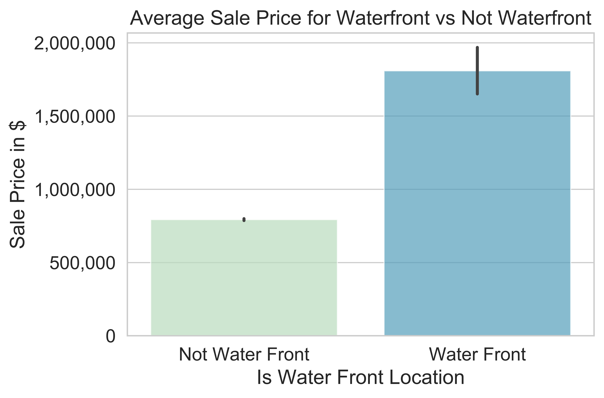
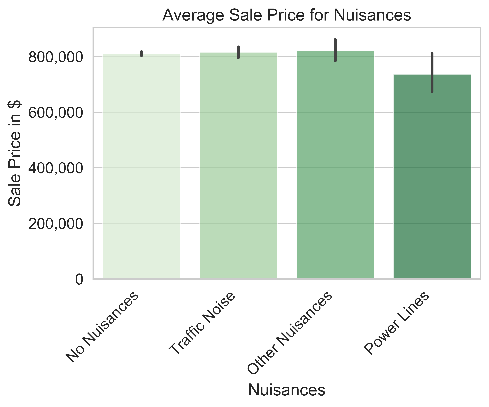

# Inferential Insights into King County Housing Prices

For this project, our goal is to build a model that provides inferential insights into real-world housing data.

## TABLE OF CONTENTS

Our home repository contains the project environment and information about our project.

The notebooks folder contains folders: the report folder which houses an organized polished file containing the entire project, and an exploratory folder, which houses an exploration of the data we each individually took part in, which constituted our workflow. The notebook folder also contains readme files to further explain the contents.

The data folder contains all the data we needed to import for the project.
Note: As many of these files are too large to include in the repo, you can download the data using the instructions we have provided in our final notebook

The reports folder contains the pdf presentation of our project. It also has an figures folder in which we outputted all of our images.

the references folder contains any sources we used to aid our project.

## BACKGROUND

The factors that influence housing prices interest many people, from homeowners hoping to improve the market potential of their current homes, to policymakers making decisions about investment in public projects. Often we rely on the "expert judgement" of real estate professionals to determine which factors are the most important, but these recommendations may be out-of-date, irrelevant to our particular housing market, or otherwise inaccurate.

## PROJECT GOAL

Stakeholders in King County, WA have requested statistical analysis to validate several claims about housing prices in the most recent full calendar year, 2019.

Six of the claims can be addressed directly with the three datasets (from the King County Department of Assessments) described later in this document:

1. Higher square footage increases home sale price
2. Having a porch increases home sale price
3. Having a beachfront or lakefront increases home sale price
4. The presence of a nuisance (power lines, traffic noise, airport noise) decreases home sale price

We will build a linear regression model to represent sales prices in King County, and use it to address these claims as well find other features that have a correlation with  home sale price.

We will specifically be focusing on finding what features of a house can increase home sale price and suggest to a house flipper what they can do to add value to a house.

## THE DATASET

For this project, we will be working with the King County House Sales dataset.
The data itself (CSV files) and descriptions of the data (DOC files) can be downloaded [here](https://info.kingcounty.gov/assessor/DataDownload/default.aspx).

Additional information about the `MAJOR` and `MINOR` attributes can be found [here](https://www5.kingcounty.gov/sdc/Metadata.aspx?Layer=parcel#AttributeInfo).

<u>The particular tables we are using for this analysis are:</u>

 - Real Property Sales
 - Residential Building
 - Parcel

There is also a table called "Lookup" that explains the meaning of many of the attributes in the above tables (e.g. the `Street Surface` attribute of a parcel is a number with lookup code 60, which indicates that `1` means `PAVED`, `2` means `GRAVEL`, `3` means `DIRT`, and `4` means `UNDEVELOPED`).

## THE PROCESS

### Data Preparation

Through Pandas, we performed necessary data cleaning, including merging of tables, and pulled in all relevant data for analysis in a linear regression model. We included columns from the data sets that we thougt would have a correlation with Sale Price. We filtered, remapped, and cleaned the data to feed into our model. We considered many features as well as scaling or one-hot encoding required to feed the data into a linear regression model.

### 2. Data Exploration

We have generated visualizations of the data during this phase to get a good sense of the data including different features and how they affected the price of homes. First we calculated the correlation values of each feature to sale price and focused on exploring features with high correlation to price. For these visualizations, we used matplotlip, geopandas, and seaborn.

### 4. Modeling

The modeling phase in this project should be a brief stop-over as you are jumping back and forth between the data preparation and the evaluation phases.  If the data preparation was done correctly, it only takes a few lines of code to build a linear regression model.  Then you should be able to print out your model's metrics and quickly move to the evaluation phase.

(In future modules, there will be more complex steps involved with tuning the model itself.)

 - Build a linear regression model with a target variable of home sale price, which is statistically valid such that any interpretation of coefficients are valid
    - Do your best to have features meet the assumptions of a linear regression (no multicollinearity, linear with respect to the outcome variable, errors are normally distributed, etc.). 
      - Note: This is difficult! We will be looking most of all for _improvement_ on this score. In order to demonstrate improvement, you should create a (not very good) model that will serve as a kind of _baseline_. Then you can compare future regression models that you build with that baseline.
    - Try to maximize R2 _without breaking any assumptions_
 - Address at least 3 of the 9 claims about housing prices made by subject-matter experts
    - Report the effect size as well as the statistical significance
    - It is perfectly acceptable to report a non-finding here
 - Communicate your findings

### 6. Deployment

When you are approaching the end of the available time, choose your best model and report what it says about your research questions. An example finding you might report is: "There is a statistically significant relationship between `<x variable>` and housing price. For every increase of 1 `<x variable>`, the housing price increases by `<amount>`, all else being equal". Consider what types of visualizations would help to communicate the scale and direction of these findings.

Beyond just the numbers, tie these findings into a broader narrative that incorporates your business understanding.  Complete the deliverables listed above, and make sure you can answer the following questions about your process:

 - "How did you pick the question(s) that you did?"
 - "Why are these questions important from a business perspective?"
 - "How did you decide on the data cleaning options you performed?"
 - "Why did you choose a given method or library?"
 - "Why did you select those visualizations and what did you learn from each of them?"
 - "Why did you pick those features as predictors?"
 - "How would you interpret the results?"
 - "How confident are you in the predictive quality of the results?"
 - "What are some of the things that could cause the results to be wrong?"

## Citations

