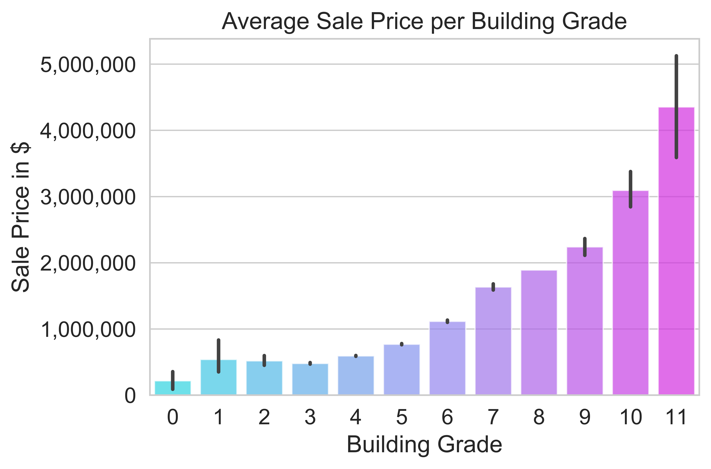
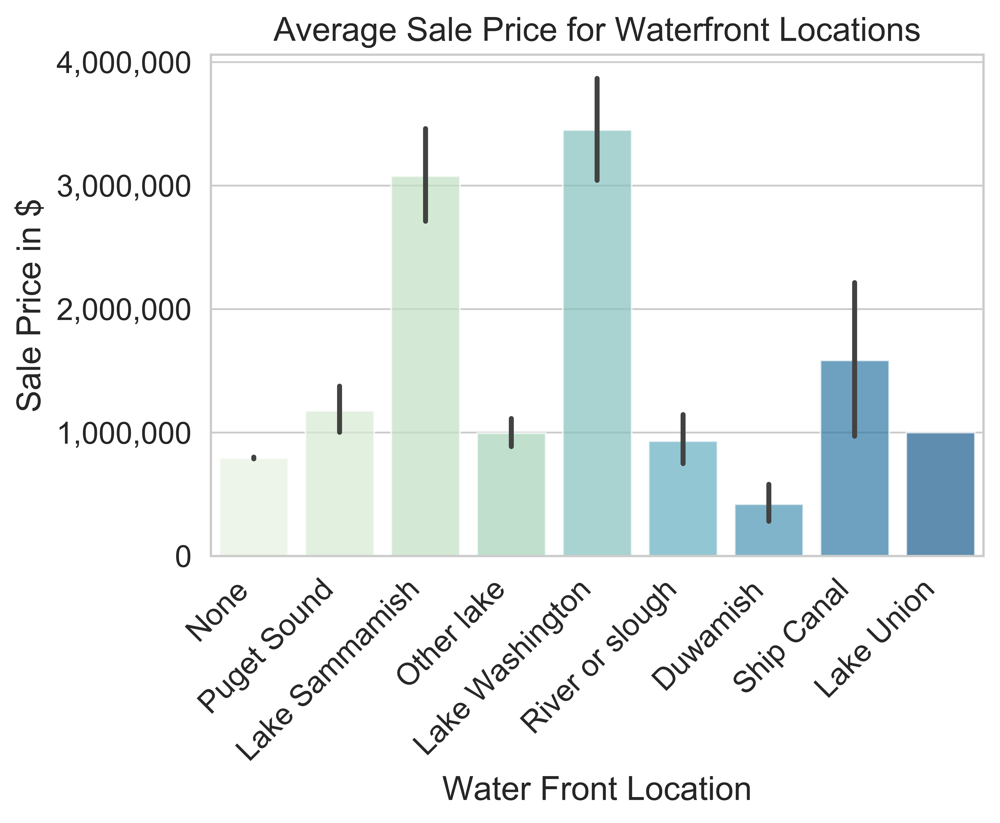

# Inferential Insights into King County Housing Prices

For this project, our goal is to build a model that provides inferential insights into real-world housing data.

## TABLE OF CONTENTS

Our home repository contains the project environment and information about our project.

#### notebooks:
[Final Report Notebook](notebooks/final/final_notebook.ipynb)

-houses an organized polished file containing the entire project

[Exploratory Data Analysis](notebooks/eda) 

-exploratory folder, which houses an exploration of the data we each individually took part in, which constituted our workflow.
    

#### data

[Raw Data](data/raw)

-contains all the data we needed to import for the project.

Note: As many of these files are too large to include in the repo, you can download the data using the instructions we have provided in our final notebook

[Cleaned Dataset](data/clean)

-clean folder contains a csv of our cleaned dataset

#### reports

[Executive Summary](reports)

-contains the pdf presentation of our project. 

[Visualizations](reports/figures)

-figures folder in which we outputted all of our images.
    

#### references 

[References](references)
contains any PDFs of references we used to aid our project.

## BACKGROUND

The factors that influence housing prices interest many people, from homeowners hoping to improve the market potential of their current homes, to policymakers making decisions about investment in public projects. Often we rely on the "expert judgement" of real estate professionals to determine which factors are the most important, but these recommendations may be out-of-date, irrelevant to our particular housing market, or otherwise inaccurate.

## PROJECT GOAL

Stakeholders in King County, WA have requested statistical analysis to validate several claims about housing prices in the most recent full calendar year, 2019.

These claims can be addressed directly with the three datasets (from the King County Department of Assessments) described later in this document:

1. Higher square footage increases home sale price1, 2
2. Having a porch increases home sale price3, 4
3. Having a beachfront or lakefront increases home sale price5
4. The presence of a nuisance (power lines, traffic noise, airport noise) decreases home sale price1, 5

We will build a linear regression model to represent sales prices in King County, and use it to address these claims as well find other features that have a correlation with  home sale price.

We will specifically be focusing on finding what features of a house can increase home sale price and suggest to a house flipper what they can do to add value to a house.

## THE DATASET

For this project, we will be working with the King County House Sales dataset.
The data itself (CSV files) and descriptions of the data (DOC files) can be downloaded [here](https://info.kingcounty.gov/assessor/DataDownload/default.aspx).

Additional information about the `MAJOR` and `MINOR` attributes can be found [here](https://www5.kingcounty.gov/sdc/Metadata.aspx?Layer=parcel#AttributeInfo).

<u>The particular tables we are using for this analysis are:</u>

 - Real Property Sales
 - Residential Building
 - Parcel

There is also a table called "Lookup" that explains the meaning of many of the attributes in the above tables (e.g. the `Street Surface` attribute of a parcel is a number with lookup code 60, which indicates that `1` means `PAVED`, `2` means `GRAVEL`, `3` means `DIRT`, and `4` means `UNDEVELOPED`).

## THE PROCESS

### Data Preparation

Through Pandas, we performed necessary data cleaning, including merging of tables, and pulled in all relevant data for analysis in a linear regression model. We included columns from the data sets that we thought would have a correlation with Sale Price. We filtered, remapped, and cleaned the data to feed into our model. We considered many features as well as scaling or one-hot encoding required to feed the data into a linear regression model.

### Data Exploration

We have generated visualizations of the data during this phase to get a good sense of the data including different features and how they affected the price of homes. First we calculated the correlation values of each feature to sale price and focused on exploring features with high correlation to price. For these visualizations, we used matplotlip, geopandas, and seaborn.

Sale Price Range we are including in the data:

Min:  $10,000 

Max:  $10,050,000 

Average:  $810,713

As we can see below, most of the houses fall under $2 million. We chose to include a high range of Sales Prices even though it heavily right skewed the distribution because we wanted to know what features of a house were included in very expensive houses.

The building grade (the quality of a house) has a high correlation with the sales price so this feature seems like it will be very statistically significant on our model.

While square feet also had quite a high correlation with sale price, we cannot include it in our model as it has too much correlation wtih another feature - building grade. The size of the house must be a factor in determining building quality.

We decided to one hot encode the Waterfront locations to delve deeper into the features

In particular Lake Sammamish and Lake Washington were correlated with high sales prices 

Some more visual explorations:

Nuisances don't seem to have much of an effect on Price of House, but we broke down nuisances to further inspect.

Aha! While noise and other nuisances dont really affect the sales prices, the presence of power lines do negatively affect the value.

### Modeling

With the helpf of the exploratory data analysis (EDA), we began building models to test these selected features. We began by breaking out some of the features into their own columns to better understand the signficance of that type of feature--we did this with "building grade" and homes that are "on the waterfront". We merged these into the main data frame.

Now that we had all of the initial significant factors based on the EDA we wanted to see all of these factors' correlation to "Sales Price".

Given that this list of features has already been paired down based on initial analysis during the EDA phase, we wanted to include all of the features into the first baseline model. This returned features that were not statistically significant, and there was high multicollinearirty among the features.  To rectify this, the first modification we took was in model 2 by taking out the features that were not statistically significant based on p-values over .05.

The second model kept the same r-quared score, maintained linearity, improved statistical significance, some improvement in multicollinearity, and did not improve in that the distribution is not normal and the variance of residuals is not spread evenly. converned about multicollinearity, we removed 'Is Water Front Location' and 'Building Grade' because we broke these out into dummie columns and wanted to use that more detailed view. Using both sets of groupped and dummies adds to the mullti-collinearity. 

From the EDA, we knew that 'Total Square Foot Living' had a significant impact on Sale Price. We wanted to see how this feature realated to the other ones, so we made a correlation matrix. This showed the correlation to other features such as homes with building grades of very high, excellent, Mansion, and with additional features such as garage, porch.  This makes sense because many of the homes with high sales price have these features and these tend to have high square footage. Given the high multicollinearity, we removed this total square foot living from the model. Also from the EDA, we knew that 'Power Lines' did have an impact on sales price and is one of the claims we set out address, so we put it back in to see if given the new improved model, it would be statistically significant and found that it was.

Our model 3 was able to rectify the multicollinearity, though the r-quared lowered a bit from .505 to .470. Linearity was maintained. We were not able to further improve on the normality or distribution of errors. We address this in the conclusion below. 

The modeling phase in this project should be a brief stop-over as you are jumping back and forth between the data preparation and the evaluation phases.  If the data preparation was done correctly, it only takes a few lines of code to build a linear regression model.  Then you should be able to print out your model's metrics and quickly move to the evaluation phase.

### Conclusion

The following graph shows us how our model 3 is doing at predicting home sale prices. 

As can be seen, our current model is under-predicting home sale prices for the first part of the price range and is over-predicting in the range between ~2.5 and 3.5 million. To correct for this under and over prediction in our model, we will want to go in to those sections and evaluate to see if there are other factors that will better help predict those ranges. 

More analysis and additional data is required to better understand these and test other possibly significant features. For example some of the additional data we would like to add is— distance to public transportation, quality of school district, and distance to grocery stores. Adding this and other data points will allow us to see if we can add any features that can improve our model. 

### Deployment

Our R-Squared is .47, meaning that our model was able to explain 47% of the variance in home sale prices. With in that, these features were statistically significant, holding the claims set out address at the begining are true. 

Our inferential model showed that:
Having a porch increases mean home price by about $74,290
Having a lakefront property, such as at Lake Washington, increases mean home price by 1.2 million 
The presence of power lines, decreases mean home price by about $66,550

So some things to keep in mind as you continue to flip homes— adding a porch and adding a finished basement can increase the overall value of a home.

 

## Citations

1. Gomez, J. 2019. "8 critical factors that influence a home’s value". OpenDoor. Available at: https://www.opendoor.com/w/blog/factors-that-influence-home-value
2. Buczynski, B. 2019. "5 Proven Ways to Increase Home Value". NerdWallet. Available at: https://www.nerdwallet.com/blog/mortgages/how-to-increase-home-value/
3. Taylor, A.B. 2019. "11 Features That Will Sell Your Home Faster". Kiplinger. Available at: https://www.kiplinger.com/slideshow/real-estate/T010-S001-home-features-today-s-buyers-want-most/index.html
4. Crow, S. 2019. "50 Clever Ways to Instantly Add Value to Your Home". BestLife. Available at: https://bestlifeonline.com/home-value-upgrades/
5. Unknown author. 2018. "5 Features That Make A Property Valuable". House Flipping School. Available at: https://houseflippingschool.com/5-features-valuable/
